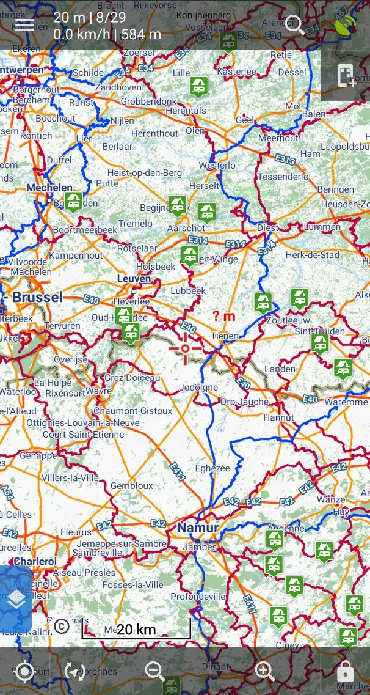

# Bivakzone / free camping in Belgium



I love free "bivouac"/wild camping areas in Belguim (so called "bivakzones") and their website [bivakzone.be](https://bivakzone.be/overzichtskaart.html), but the problem is I cannot upload points to my Locus Maps and any other offline maps app, as the website doesn't allow to export in `.gpx`. So I've decided to implement a simple script to get coordinates in GPX format.

It's just simply parsing the source code and extracts coordinates and names of the points.

Additionally, I fix wrong coordinates of a few points which are "intentionally wrong", I'll never understand why would anyone provide false information...

## Usage

```bash
pip install -r requirements.txt
python main.py
```

if everything is ok, the script should produce `bivakzones.gpx` file with ~56 points (at the time of writing in June 2022).

Feel free to report issues or ideas in Issues, contributions are welcome as well.
